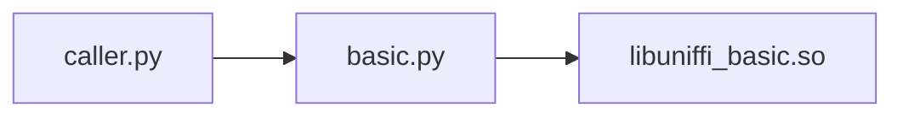

# uniffi-lab
A repo for trying the [Mozilla UniFFI library](https://github.com/mozilla/uniffi-rs) with examples. A first read to the [UniFFI user manual](https://mozilla.github.io/uniffi-rs/Getting_started.html) is
encouraged.
## Basic

An [example](./basic) with basic, primitive types. The target is to build a `generated` folder, which should contain the resultant execution chain:


- `caller.py` file would represent the client code of the FFI. An application.
- `basic.py` the python bindings to our rust code.
- `libuniffi_basic.so` The shared library, which contains all the low level FFI `extern` blocks, and the Rust logic itself.

```bash
$ cd basic/generated
$ python caller.py
2 + 4 = 6
```

### How do we get there ?

We will work in the [basic](./basic/) folder from here and create the `generated` one.

```bash
$ cd basic
$ mkdir generated
```

First we place our caller, application code at `generated/caller.py`

```python
import basic

if __name__ == "__main__":
    print("2 + 4 = {}".format(basic.add(2, 4)))
```


After defining the [UDL](./basic/src/basic.udl) file and our [rust logic](./basic/src/lib.rs),
its needed to generate the language specific bindings with:

```bash
## This works because we have a special crate in the current workspace 
## for building and run the uniffi-bindgen binary. See https://mozilla.github.io/uniffi-rs/tutorial/foreign_language_bindings.html
$ cargo run -p uniffi-bindgen generate ./src/basic.udl --language python
$ mv ./src/basic.py generated
```

Next, generate our shared library and move it to the `generated` folder:

```bash
$ cargo build --release
# Note we changed the name here to the ones the bindings expect.
$ mv ../target/release/libbasic.so generated/libuniffi_basic.so
```

Execute the result by:

```bash
$ cd basic/generated
$ python caller.py
2 + 4 = 6
```